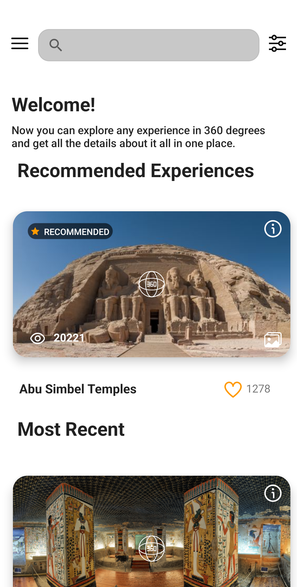
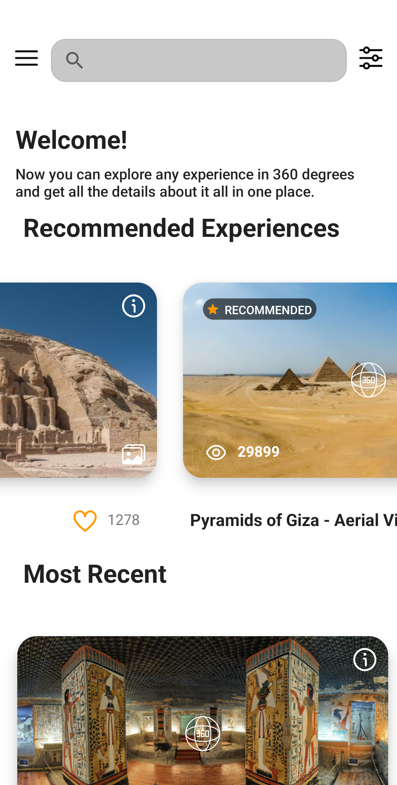
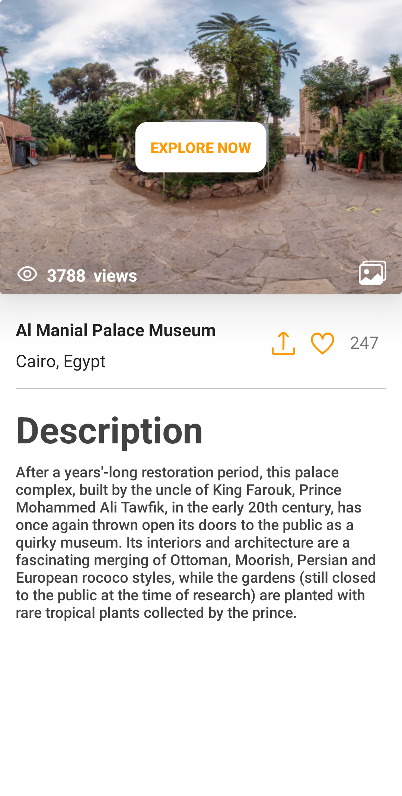
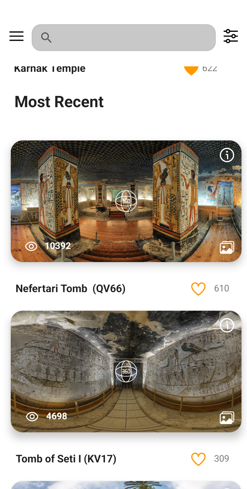
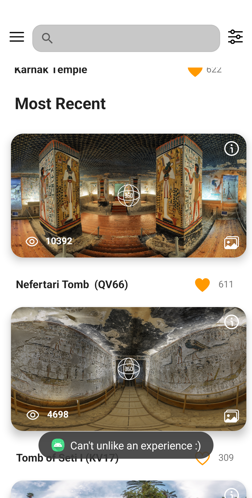
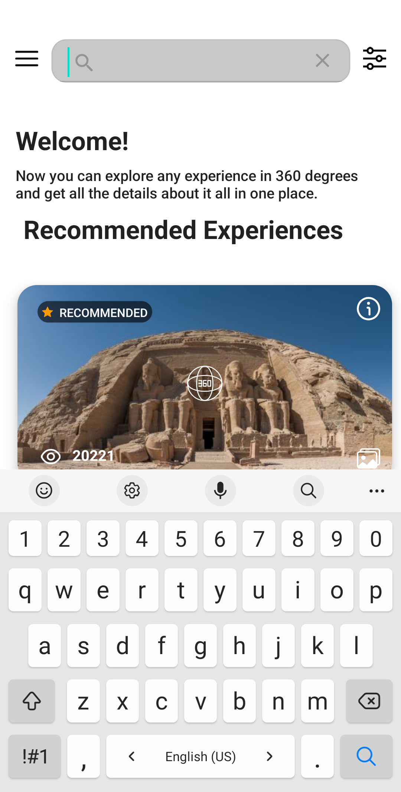

# Overview
This project is a mock of 2 screen of an already existing app. The screens show a listing of multiple virtual tours.

# Design Decisions
The data is fetched on a daily basis from the backend using a scheduled periodic work request.\
The DB is initially empty, so the data is fetched from the backend and persisted in the DB.
The local database is updated upon fetching the data from the backend. The ui is populated using data from the local DB, so that the data could be available online and offline.

# Screenshots

       
 

# Notes

1. All icons used in this app are available for free use at: [Icon Finder](https://www.iconfinder.com), [SVG Repo](https://www.svgrepo.com) , [Flat Icon](https://www.flaticon.com)
 
 
